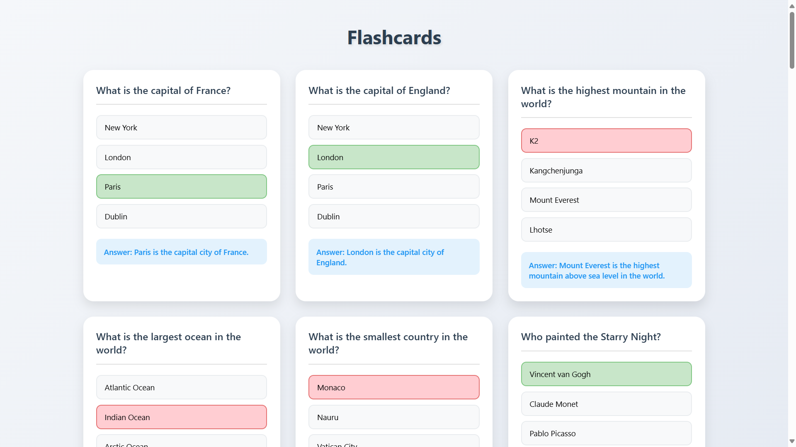

# MVC-Server

This is a simple Node.js server using the MVC (Model-View-Controller) architecture.

## Screenshot


## Prerequisites

- Node.js
- npm (Node Package Manager)

## Installation

1. Clone the repository:
    ```sh
    git clone https://github.com/bawfng04/MVC-Server.git
    cd MVC-Server
    ```

2. Install dependencies:
    ```sh
    npm install
    ```

3. Set up the environment variables:
    Create a [.env](http://_vscodecontentref_/1) file in the root directory and add the following:
    ```env
    DB_NAME=your_database_name
    DB_USER=your_database_user
    DB_PASSWORD=your_database_password
    ```

## Database Setup

1. Create the database tables:
    - Use the SQL script in [createTables.SQL](http://_vscodecontentref_/2) to create the necessary tables and insert sample data.

## Running the Server

To start the server, run:
    ```sh
    npm start
    ```

The server will be running on `http://localhost:5000`.

Open this URL on browser after run the server: `http://127.0.0.1:5500/index.html`.

## API Endpoints

### Questions

- Get all questions:
    ```
    GET /questions
    ```

- Get a question by ID:
    ```
    GET /questions/:id
    ```

### Answers

- Get all answers:
    ```
    GET /answers
    ```

- Get an answer by ID:
    ```
    GET /answers/:id
    ```

### Flashcards

- Get all flashcards:
    ```
    GET /flashcards
    ```

- Get a flashcard by ID:
    ```
    GET /flashcards/:id
    ```

## Frontend

The frontend is a simple HTML page that displays flashcards. Open [index.html](http://_vscodecontentref_/3) in your browser to view it.
